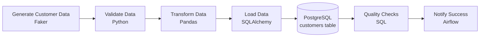
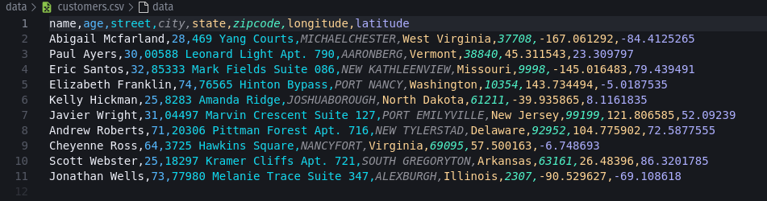
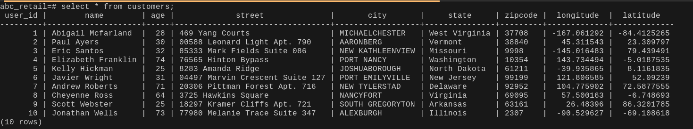

# Airflow Customer Data ETL Pipeline

<p align="center">


</p>

<p align="center">


</p>

---

## Overview

An end-to-end Apache Airflow ETL pipeline that generates customer data, validates and transforms records, loads them into PostgreSQL, and performs automated data quality checks.

This project simulates a real-world data engineering workflow for **ABC Retail**, an online retailer where customers continuously create accounts.

Every five minutes, an automated Airflow pipeline prepares the latest customer records for analytics.

The project demonstrates:

* ETL pipeline development
* Workflow orchestration
* Data validation
* Data transformation
* PostgreSQL loading
* Data quality testing
* Environment configuration

> **Requires Apache Airflow 3.x.** This project uses `airflow.providers.standard.operators.*` imports and the Simple Auth Manager, both introduced in Airflow 3.0. It will not run as-is on Airflow 2.x.

---

# Project Highlights

- Automated ETL workflow scheduled every 5 minutes
- Python-based data generation and transformation
- PostgreSQL analytical database loading
- Automated validation and quality checks
- Apache Airflow DAG orchestration
- Environment-based configuration management

---

# Architecture



---

# Screenshots

| DAG Graph View | customers.csv | PostgreSQL `SELECT` |
| --- | --- | --- |
|  |  |  |
| Task dependency graph for `customers_postgres_pipeline`, viewed in the Airflow UI (Graph tab). | Sample output of `data/customers.csv` after a `generate_data` → `transform_data` run — city values uppercased, columns lowercased. | Output of `SELECT * FROM customers LIMIT 10;` in `psql`, confirming the CSV rows landed in PostgreSQL. |

Save the three images to a `screenshots/` folder at the project root using the filenames above (`dag_graph.png`, `customers_csv.png`, `psql_select.png`), and they'll render inline both here and on GitHub.

> **Heads up when comparing the CSV and `psql` screenshots side by side:** the `customers` table now has a `user_id BIGSERIAL PRIMARY KEY` column that isn't in `customers.csv`. `pandas.to_sql` only inserts the columns present in the DataFrame, so `user_id` auto-increments on load — expect the `psql` output to show one more column than the CSV, with row *values* otherwise matching.

---

# Scenario

ABC Retail operates an online store where customers create accounts throughout the day.

The data engineering team runs an automated pipeline every five minutes to prepare customer records for analytics.

The workflow:

```text
Generate Customer Data
          |
          v
Validate Data
          |
          v
Transform Data
          |
          v
Load into PostgreSQL
          |
          v
Run Quality Checks
          |
          v
Notify Success
```

The objective is to ensure that only clean, validated customer records are stored in the analytical database.

---

# Features

* Generate realistic customer data using Faker
* Store generated records as CSV files
* Validate customer records before processing
* Transform customer data using pandas
* Load data into PostgreSQL
* Perform SQL-based quality checks
* Schedule workflows using Apache Airflow
* Demonstrate Airflow task dependencies
* Manage configuration using environment variables

---

# Tech Stack

| Technology     | Purpose                    |
| -------------- | --------------------------- |
| Python 3.10+   | Pipeline development        |
| Apache Airflow 3.x | Workflow orchestration  |
| PostgreSQL     | Analytical database         |
| pandas         | Data transformation         |
| SQLAlchemy + psycopg2 | Database loading      |
| Faker          | Synthetic data generation   |
| python-dotenv  | Environment management      |

> `apache-airflow-providers-postgres` is included in `requirements.txt` but the pipeline currently talks to PostgreSQL directly via SQLAlchemy/psycopg2 rather than the provider's `PostgresOperator`/`PostgresHook`. Keep it if you plan to add Airflow-native Postgres connections later, or drop it to trim the install.

---

# Repository Structure

```text
airflow-practice/
│
├── dags/
│   └── customers_postgres_pipeline.py
│
├── data/
│   └── customers.csv
│
├── screenshots/
│   ├── dag_graph.png
│   ├── customers_csv.png
│   └── psql_select.png
│
├── logs/                          # gitignored — created at runtime
│
├── airflow.cfg                    # gitignored — created at runtime
├── airflow.db                     # gitignored — created at runtime
├── simple_auth_manager_passwords.json.generated   # gitignored — created at runtime
├── env.example
├── requirements.txt
├── README.md
├── LICENSE
└── .gitignore
```

---

# DAG Overview

DAG name:

```text
customers_postgres_pipeline
```

Schedule:

```python
schedule=timedelta(minutes=5)
```

Pipeline tasks:

| Task           | Operator       | Description                |
| -------------- | -------------- | -------------------------- |
| generate_data  | PythonOperator | Generates customer records |
| validate_data  | PythonOperator | Validates customer data    |
| transform_data | PythonOperator | Cleans customer data       |
| load_postgres  | PythonOperator | Loads PostgreSQL table     |
| quality_checks | PythonOperator | Validates database records |
| notify_success | BashOperator   | Confirms completion        |

Operators are imported from `airflow.providers.standard.operators.python` and `airflow.providers.standard.operators.bash` (the Airflow 3 provider paths — these operators moved out of `airflow.operators` core in Airflow 3.0).

**Graph view:**


---

# Pipeline Steps

## 1. Generate Customer Data

Customer records are generated using Faker (10 records per run).

Fields generated:

* Name
* Age (18–80)
* Street address
* City
* State
* Zip code
* Longitude
* Latitude

Output:

```text
data/customers.csv
```

**Sample output** (after `transform_data` has run — columns lowercased, city uppercased):


---

## 2. Validate Data

The validation step ensures:

* CSV file is not empty
* Customer names exist (no nulls)
* Ages are between 18 and 80

If validation fails, the DAG stops.

---

## 3. Transform Data

Current transformations:

* Convert column names to lowercase
* Convert city names to uppercase

Example:

Before:

```text
City
Cape Town
```

After:

```text
city
CAPE TOWN
```

---

## 4. Load into PostgreSQL

Customer records are appended into the `customers` table using SQLAlchemy's `to_sql` (`if_exists="append"`), so each DAG run adds new rows rather than replacing existing ones.

---

## 5. Quality Checks

The pipeline checks:

* Total loaded records
* Missing customer names (fails the task if any are found)

```sql
SELECT COUNT(*) FROM customers;
```

```sql
SELECT COUNT(*)
FROM customers
WHERE name IS NULL;
```

---

## 6. Notify Success

Final Airflow task:

```text
Pipeline completed successfully!
```

---

# Installation

## Clone Repository

```bash
git clone https://github.com/yamkela-macwili/airflow-practice.git

cd airflow-practice
```

---

## Create Virtual Environment

Linux/macOS:

```bash
python -m venv .venv

source .venv/bin/activate
```

Windows:

```powershell
python -m venv .venv

.venv\Scripts\activate
```

---

## Install Dependencies

```bash
pip install -r requirements.txt
```

---

# Airflow Setup

Set Airflow home to the current project directory:

```bash
export AIRFLOW_HOME=$(pwd)
```

Verify:

```bash
echo $AIRFLOW_HOME
```

This stores:

* airflow.cfg
* airflow.db
* logs
* simple_auth_manager_passwords.json.generated

inside the project folder.

---

# Initialize Airflow

Airflow 3 replaced `airflow db init` with `airflow db migrate`:

```bash
airflow db migrate
```

Airflow 3 no longer manages users via `airflow users create` by default — it ships with **Simple Auth Manager**, which auto-generates an `admin` user and password on first run. You don't need to create a user manually; skip to **Start Airflow** below and read the generated password from `simple_auth_manager_passwords.json.generated`.

If you'd rather manage users explicitly the Airflow 2 way, switch `[core] auth_manager` to `FabAuthManager` in `airflow.cfg` first — Simple Auth Manager doesn't support the `airflow users create` command.

---

# Environment Configuration

Create your `.env` file from the provided example:

```bash
cp env.example .env
```

`env.example`:

```env
POSTGRES_USER=
POSTGRES_PASSWORD=
POSTGRES_HOST=localhost
POSTGRES_PORT=5432
POSTGRES_DB=abc_retail

DATA_DIR=data
```

Fill in `POSTGRES_USER` and `POSTGRES_PASSWORD` with your local PostgreSQL credentials. Set `DATA_DIR` to `data` so generated CSVs land in the `data/` folder shown in the repo structure above.

---

# PostgreSQL Setup

Open PostgreSQL:

```bash
sudo -u postgres psql
```

Create database:

```sql
CREATE DATABASE abc_retail;
```

Connect:

```sql
\c abc_retail
```

Create table:

```sql
CREATE TABLE customers (
    user_id BIGSERIAL PRIMARY KEY,
    name VARCHAR(255),
    age INTEGER,
    street VARCHAR(255),
    city VARCHAR(255),
    state VARCHAR(255),
    zipcode VARCHAR(20),
    longitude DOUBLE PRECISION,
    latitude DOUBLE PRECISION
);
```

Exit:

```sql
\q
```

---

# Start Airflow

Airflow 3 splits the webserver into a separate API server, and DAG parsing into its own process. For local development, the simplest option is:

```bash
airflow standalone
```

This starts the API server, scheduler, dag-processor, and triggerer together, and prints the auto-generated admin password to the terminal.

To run components separately instead:

```bash
airflow api-server --port 8080
airflow scheduler
airflow dag-processor
```

Open:

```text
http://localhost:8080
```

Login:

```text
Username: admin
Password: <see terminal output, or cat simple_auth_manager_passwords.json.generated>
```

Enable:

```text
customers_postgres_pipeline
```

---

# DAG Not Showing in Airflow UI

If the DAG exists but is missing from the Airflow UI:

Re-serialize DAGs:

```bash
airflow dags reserialize
```

Restart the scheduler and dag-processor:

```bash
airflow scheduler
airflow dag-processor
```

Check DAG list:

```bash
airflow dags list
```

Check import errors:

```bash
airflow dags list-import-errors
```

---

# Verify PostgreSQL Records

Connect:

```bash
sudo -u postgres psql
```

List databases:

```sql
\l
```

Connect:

```sql
\c abc_retail
```

List tables:

```sql
\dt
```

Describe table:

```sql
\d customers
```

View records:

```sql
SELECT * FROM customers LIMIT 10;
```

**Sample output:**


Compare row values against `data/customers.csv` — names, cities (uppercased), and coordinates should match one-to-one aside from the auto-generated `user_id` column.

Count rows:

```sql
SELECT COUNT(*) FROM customers;
```

Check missing names:

```sql
SELECT COUNT(*)
FROM customers
WHERE name IS NULL;
```

Expected:

```text
0
```

Exit:

```sql
\q
```

---

# Expected Results

A successful DAG run will:

- Generate customer records
- Validate incoming data
- Transform records
- Load PostgreSQL
- Pass quality checks
- Complete successfully in Airflow

---

# Learning Objectives

This project demonstrates:

* Building ETL pipelines
* Creating Airflow DAGs
* Using Airflow operators (Airflow 3 provider paths)
* Managing task dependencies
* Data validation
* Data transformation
* PostgreSQL integration
* Data quality engineering
* Environment management

---

# Future Improvements

* Add Docker Compose deployment
* Add Airflow Connections (use `apache-airflow-providers-postgres`'s `PostgresHook` instead of a hardcoded SQLAlchemy engine)
* Add automated tests
* Add Slack/email notifications
* Store raw data in cloud storage
* Implement incremental loading
* Add schema validation
* Add monitoring and alerting
* Add CI/CD pipeline

---

# License

MIT License — see [LICENSE](./LICENSE) for the full text.

Copyright (c) 2026 Yamkela Macwili